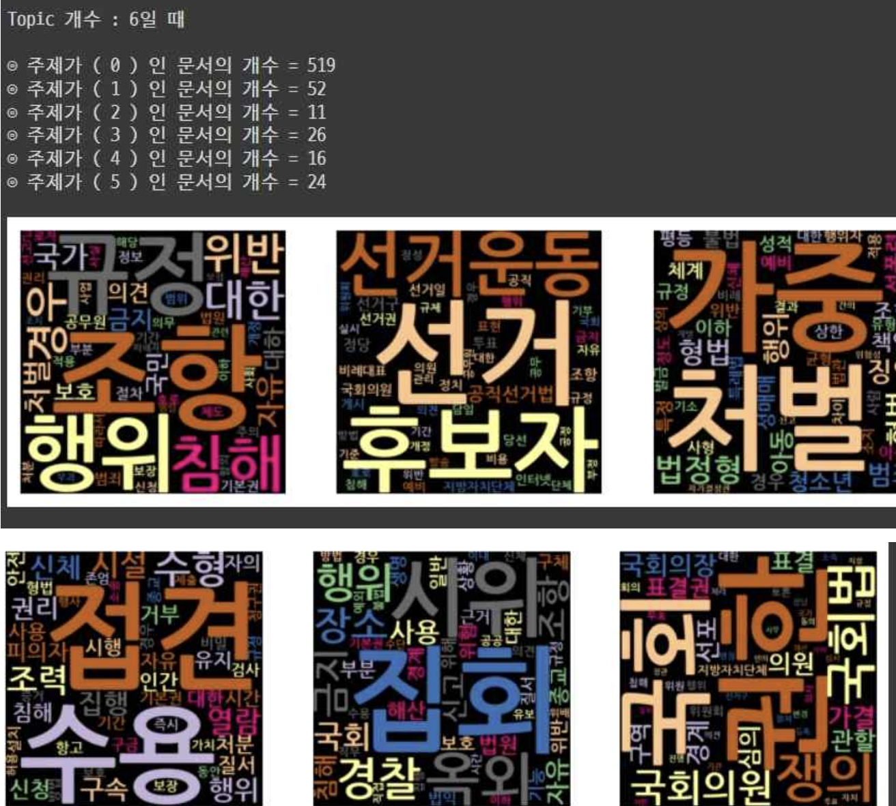
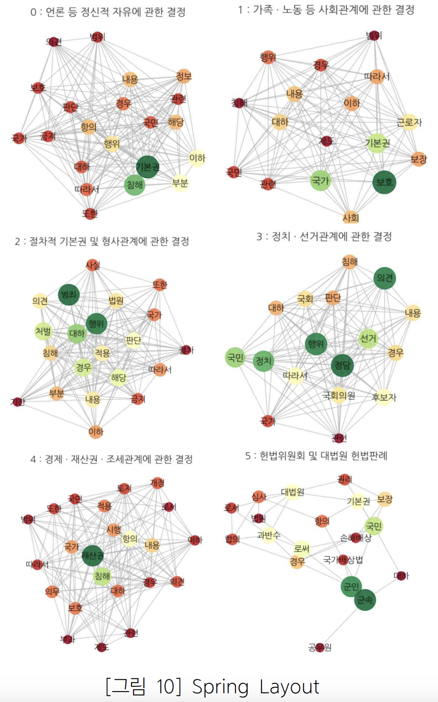
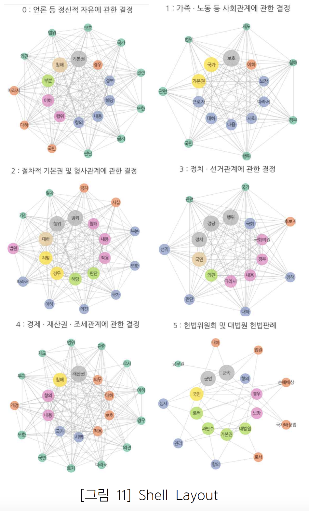

# 헌법재판소 결정문 분석 및 결정문 카테고리 분류 모델
Constitutional Court Decision Analysis and Decision Category Classification Model

## Introduction

대한민국 헌법을 심사 기준으로 하는 헌법재판소의 결정문을 분석하고, 다양한 법적 카테고리로 분류하는 모델을 개발한 프로젝트입니다.

- 헌법재판소의 결정문을 scraping 및 preprocessing
- Topic Modeling으로 결정문을 분류, Word Cloud와 Sementic Network를 사용하여 시각화
- LSTM, Bi-LSTM, GRU, CNN을 사용하여 category를 분류하는 모델 구축
- Streamlit을 사용하여 새로운 결정문을 분류하는 Website 제작

## Results

### Topic Modeling - Word Cloud

### Sementic Network

Spring Layout

Shell Layout