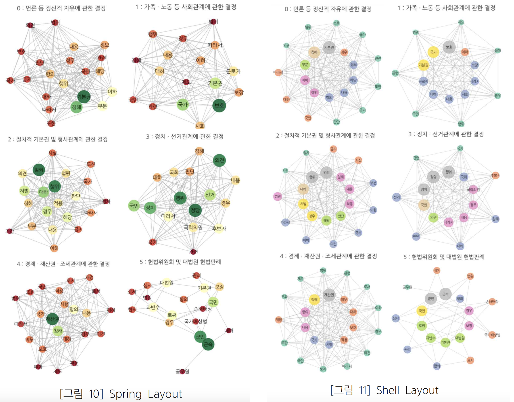
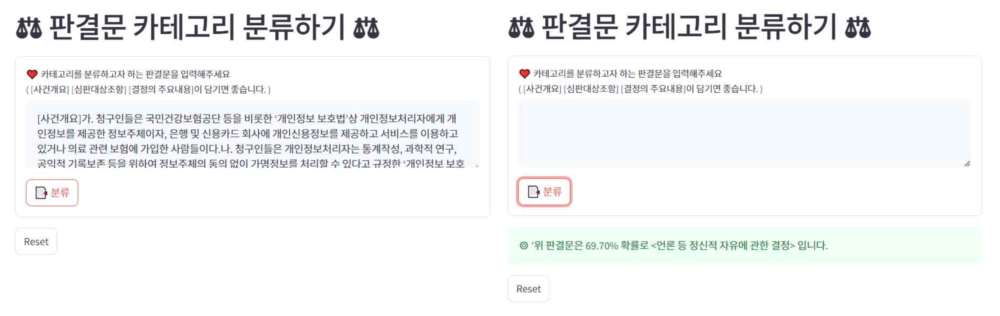

# 헌법재판소 결정문 분석 및 결정문 카테고리 분류 모델
Constitutional Court Decision Analysis and Decision Category Classification Model

## Introduction

대한민국 헌법을 심사 기준으로 하는 헌법재판소의 결정문을 분석하고, 다양한 법적 카테고리로 분류하는 모델을 개발한 프로젝트입니다.

- 헌법재판소의 결정문을 `scraping` 및 `preprocessing`
- `Topic Modeling`으로 결정문을 분류, `Word Cloud`와 `Sementic Network`를 사용하여 시각화
- `LSTM, Bi-LSTM, GRU, CNN`을 사용하여 category를 분류하는 모델 구축
- `Streamlit`을 사용하여 새로운 결정문을 분류하는 Website 제작

## Results

### 🔍 Topic Modeling - Word Cloud

### 🔍 Sementic Network

### 🔍 Decision Category Classification Model
각 모델의 Loss 및 Accuracy와 Confusion Matrix는 `img/results/` 에서 확인 가능

### 🔍 Website
